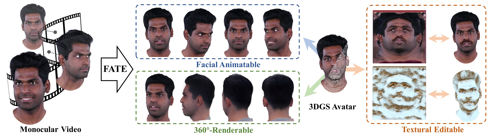
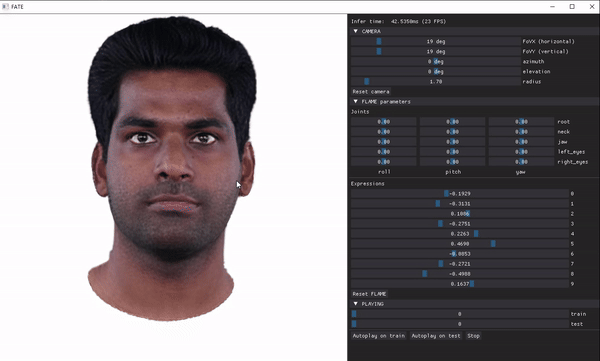
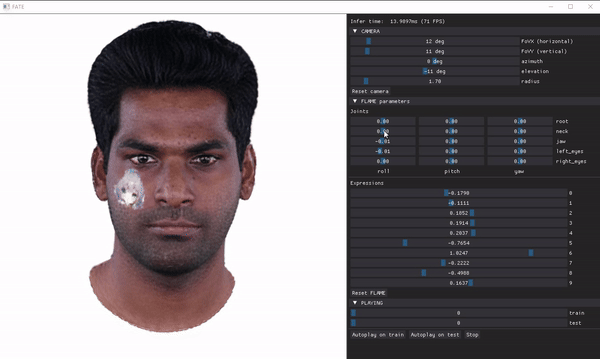

# FATE

Code for "FATE: Full-head Gaussian Avatar with Textural Editing from Monocular Video" (FateAvatar).

[Jiawei Zhang](https://zjwsite.github.io/)<sup>1</sup>, [Zijian Wu](https://github.com/Zijian-Wu)<sup>1</sup>, [Zhiyang Liang](https://github.com/ZhiyangLiang?tab=repositories)<sup>1</sup>, [Yicheng Gong](https://github.com/Gong-Yicheng)<sup>1</sup>, [Dongfang Hu]()<sup>2</sup>, [Yao Yao](https://yoyo000.github.io/)<sup>1</sup>, [Xun Cao](https://cite.nju.edu.cn/People/Faculty/20190621/i5054.html)<sup>1</sup>, and [Hao Zhu](http://zhuhao.cc/home/)<sup>1+</sup>

<sup>1</sup>Nanjing University, <sup>2</sup>OPPO

<sup>+</sup>corresponding author

[[Paper](https://arxiv.org/abs/2411.15604)] | [[中文文档](./doc-CN/README.md)] | [[Project Page](https://zjwfufu.github.io/FATE-page/)]

> Reconstructing high-fidelity, animatable 3D head avatars from effortlessly captured monocular videos is a pivotal yet formidable challenge. Although significant progress has been made in rendering performance and manipulation capabilities, notable challenges remain, including incomplete reconstruction and inefficient Gaussian representation. To address these challenges, we introduce FATE — a novel method for reconstructing an editable full-head avatar from a single monocular video.  FATE integrates a sampling-based densification strategy to ensure optimal positional distribution of points, improving rendering efficiency.  A neural baking technique is introduced to convert discrete Gaussian representations into continuous attribute maps, facilitating intuitive appearance editing.  Furthermore, we propose a universal completion framework to recover non-frontal appearance, culminating in a 360$^\circ$-renderable 3D head avatar. FATE outperforms previous approaches in both qualitative and quantitative evaluations, achieving state-of-the-art performance.  To the best of our knowledge, FATE is the first animatable and 360$^\circ$ full-head monocular reconstruction method for a 3D head avatar.

<div align=center>
  
</div>

## Installation

For compatibility reasons, we recommend running this repository in Linux. Installation on Windows 10 is also available, but you may encounter some issues like [this](https://github.com/cleardusk/3DDFA_V2/issues/12). We have done testing and development on RTX3090, RTX3080 and V100 GPUs. Please make sure your device support CUDA toolkit 11.6 or later.

- Clone this repository and create conda environment

  ```
  git clone https://github.com/zjwfufu/FateAvatar.git --recursive
  
  conda env create -f environment.yml
  ```

- Install 3DGS dependencies

  ```
  cd submodules
  pip install ./diff-gaussian-rasterization
  pip install ./simple-knn
  cd ..
  ```

- Install PyTorch3D (We use PyTorch3D 0.7.7 in experiment)

  ```
  git clone https://github.com/facebookresearch/pytorch3d.git
  cd pytorch3d && pip install .
  ```

- Some functional dependencies

  ```
  # for completion framework
  pip install cmake dlib
  
  cd submodules/3DDFA_V2
  bash build.sh	# you may need install manually in Win10
  cd ..
  
  # for monogaussianavatar baseline
  pip install functorch==0.2.0
  
  # for splattingavatar baseline
  pip install libigl packaging pybind11
  
  cd submodules/simple_phongsurf
  pip install .
  cd ..
  ```

- Download weights

  | Model                        | Links                                                        |
  | ---------------------------- | ------------------------------------------------------------ |
  | FLAME2020                    | [generic_model.pkl](https://flame.is.tue.mpg.de/)            |
  | SphereHead                   | [spherehead-ckpt-025000.pkl](https://cuhko365-my.sharepoint.com/personal/223010106_link_cuhk_edu_cn/_layouts/15/onedrive.aspx?id=%2Fpersonal%2F223010106%5Flink%5Fcuhk%5Fedu%5Fcn%2FDocuments%2FRelease%2FECCV24%5FSphereHead%2FSphereHead%5Fmodel%5Frelease%2Fspherehead%2Dckpt%2D025000%2Epkl&parent=%2Fpersonal%2F223010106%5Flink%5Fcuhk%5Fedu%5Fcn%2FDocuments%2FRelease%2FECCV24%5FSphereHead%2FSphereHead%5Fmodel%5Frelease&ga=1) |
  | GFPGAN1.3                    | [GFPGANv1.3.pth](https://github.com/TencentARC/GFPGAN/releases/download/v1.3.0/GFPGANv1.3.pth) |
  | VGG16 for Perpetual Loss     | [vgg16.pt](https://nvlabs-fi-cdn.nvidia.com/stylegan2-ada-pytorch/pretrained/metrics/vgg16.pt) |
  | Landmark Detection from Dlib | [shape_predictor_68_face_landmarks.dat](https://github.com/italojs/facial-landmarks-recognition/blob/master/shape_predictor_68_face_landmarks.dat) |
  | MODNet                       | [modnet_webcam_portrait_matting.ckpt](https://drive.google.com/drive/folders/1umYmlCulvIFNaqPjwod1SayFmSRHziyR) |
  | Face Parsing                 | [79999_iter.pth](https://drive.google.com/file/d/154JgKpzCPW82qINcVieuPH3fZ2e0P812/view?usp=drive_open) |
  | Parsing Net                  | [parsing_parsenet.pth](https://github.com/sczhou/CodeFormer/releases/download/v0.1.0/parsing_parsenet.pth) |

## Data

We support datasets from both [IMAvatar](https://github.com/zhengyuf/IMavatar) and [INSTA](https://github.com/Zielon/INSTA) preprocessing pipelines. For the layout of the IMAvatar dataset, please refer to [here](https://github.com/zjwfufu/FateAvatar/blob/b39642aa34e451350eba85996dc0735192c5473e/train/dataset.py#L127), and for the layout of the INSTA dataset, please refer to [here](https://github.com/zjwfufu/FateAvatar/blob/b39642aa34e451350eba85996dc0735192c5473e/train/dataset.py#L336). The `./data` folder should have the following structure:

```
.
|-- insta
|   |-- bala
|   |-- obama
|	|-- ....
|-- imavatar
    |-- yufeng
    |-- person1
    |-- ...
```

> [!NOTE]
> For the IMAvatar dataset, we further applied [face-parsing](https://github.com/zllrunning/face-parsing.PyTorch) to remove clothing. For the INSTA dataset, we modified [this script](https://github.com/Zielon/INSTA/blob/3dc6f865e36c7a64632b85f99cc170891e51d44a/scripts/transforms.py#L44) to dump FLAME-related attributes.

We use publicly available datasets from [INSTA](https://github.com/Zielon/INSTA), [PointAvatar](https://github.com/zhengyuf/PointAvatar/tree/master), [Emotalk3D](https://nju-3dv.github.io/projects/EmoTalk3D/). and [NerFace](https://github.com/gafniguy/4D-Facial-Avatars). To access the Emotalk3D dataset, please request [here](https://nju-3dv.github.io/projects/EmoTalk3D/static/license/LicenseAgreement_EmoTalk3D.pdf).

*We will release the processed datasets soon .*

##  Pretrained

*We will release the pretrained models and checkpoints soon.*

## Usage

Train the head avatar from monocular video using the following command:

```
python train_mono_avatar.py \
    --model_name <MODEL_NAME> \
    --config <CONFIG_PATH> \ 
    --root_path <DATASET_PATH> \
    --workspace <EXP_DIR> \
    --name <EXP_NAME>
    [--resume]
```

- `--model_name`

  The head avatar reconstruction methods we provide are: `["FateAvatar", "GaussianAvatars", "FlashAvatar", "SplattingAvatar", "MonoGaussianAvatar"]`.

- `--config`

  The configuration files can be found in the `./config`, where we provide YAML files for each method.

- `--root_path`

  The dataset path, please ensure that the path string includes `imavatar` or `insta` to specify which dataset type to be loaded.

- `--workspace`

  The experiment save path. Training logs, snapshots, checkpoints, and various media will be organized under this directory.

- `--name`

​	The identifier for each experiment.

- `--resume`

​	Enable to train from existing checkpoint from `workspace`.

Generate pseudo data from the completion framework using the following command:

```
python train_generate_pseudo.py \
    --model_name <MODEL_NAME> \
    --config <CONFIG_PATH> \ 
    --workspace <EXP_DIR> \
    --name <EXP_NAME>
```

Complete the head avatar obtained from the monocular video using the following command:

```
python train_full_avatar.py \
    --model_name <MODEL_NAME> \
    --config <CONFIG_PATH> \ 
    --root_path <DATASET_PATH> \
    --workspace <EXP_DIR> \
    --name <EXP_NAME>
```

Perform neural baking on the trained head avatar using the following command:

```
python train_neural_baking.py \
    --config <CONFIG_PATH> \ 
    --root_path <DATASET_PATH> \
    --workspace <EXP_DIR> \
    --name <EXP_NAME> \
    [--use_full_head_resume]
```

> [!NOTE]
> Neural baking is only available in `FateAvatar`.

- `--use_full_head_resume`

  If is True, it will bake the checkpoint processed through completion framework from `--workspace`.

A training example is shown below:

```bash
MODEL_NAME="FateAvatar"
CONFIG_PATH="./config/fateavatar.yaml"
DATASET_PATH="./data/insta/bala"
EXP_DIR="./workspace/insta/bala"
EXP_NAME="fateavatar_insta_bala"

python train_mono_avatar.py --model_name $MODEL_NAME --config $CONFIG_PATH --root_path $DATASET_PATH \
    --workspace $EXP_DIR --name $EXP_NAME

python train_generate_pseudo.py --model_name $MODEL_NAME --config $CONFIG_PATH --workspace $EXP_DIR \
    --name $EXP_NAME

python train_full_avatar.py --model_name $MODEL_NAME --config $CONFIG_PATH --root_path $DATASET_PATH \
    --workspace $EXP_DIR --name $EXP_NAME

python train_neural_baking.py --config $CONFIG_PATH --root_path $DATASET_PATH \
    --workspace $EXP_DIR --name $EXP_NAME
```

For the baked avatar, we provide a script for textural editing. You can also customize additional editing items in `./edit_assets`:

```
python avatar_edit_baked.py \
    --config <CONFIG_PATH> \ 
    --root_path <DATASET_PATH> \
    --workspace <EXP_DIR> \
    --name <EXP_NAME> \
    [--use_full_head_resume]
```

- `--use_full_head_resume`

  If is True, it will edit on the **baked** full-head checkpoint from `--workspace`.

We also provide a script for cross-reenactment:

```
python avatar_reenact.py \
    --config <CONFIG_PATH> \
    --model_name <MODEL_NAME> \
    --dst_path <DATASET_PATH> \
    --workspace <EXP_DIR> \
    --name <EXP_NAME> \
```

- `--dst_path`:

  Path to the target head avatar dataset.

> [!NOTE]
> Cross-reenactment can only be supported between source and target head avatars from the **same dataset type**.

## Viewer

We customize a local viewer for interacting with the processed head avatar:

```
python avatar_gui.py \
	--model_name <MODEL_NAME> \
	--config <CONFIG_PATH> \
	--workspace <EXP_DIR> \
	--name <EXP_NAME> \
	[--ckpt_path <CKPT_PATH>] \
	[--use_full_head_resume] \
	[--use_baked_resume]
```

- `--ckpt_path`:

​	If `ckpt_path` is provided, it will load the checkpoint from the specified path.

- `--use_full_head_resume`:

​	If is True, it will automatically load full-head checkpoints from `--workspace`.

- `--use_baked_resume`:

​	If is True, it will load baked checkpoints from `--workspace`. When both `use_full_head_resume` and `use_baked_resume` are True, it will load the full-head checkpoint after neural baking (if it exists). 

#### Full-head completion

<div align=center>
  
</div>

#### Sticker editing

<div align=center>
  
</div>

#### Style transfer

<div align=center>
  
</div>


## Acknowledgement

This repository is built on [3DGS](https://github.com/gafniguy/4D-Facial-Avatars/issues/57#issuecomment-1744790191) and  incorporates several amazing open source project: [3DDFA_V2](https://github.com/gafniguy/4D-Facial-Avatars/issues/57#issuecomment-1744790191), [SphereHead](https://lhyfst.github.io/spherehead/), [MODNet](https://github.com/ZHKKKe/MODNet), [Face-parsing](https://github.com/zllrunning/face-parsing.PyTorch) and [GFPGAN](https://github.com/ZHKKKe/MODNet). GUI is inspired by [DreamGaussian](https://github.com/dreamgaussian/dreamgaussian) and [GaussianAvatars](https://github.com/ShenhanQian/GaussianAvatars?tab=readme-ov-file).

We thank [FlashAvatar](https://github.com/USTC3DV/FlashAvatar-code), [SplattingAvatar](https://github.com/initialneil/SplattingAvatar), [MonoGaussianAvatar](https://github.com/yufan1012/MonoGaussianAvatar) and [GaussianAvatars](https://github.com/ShenhanQian/GaussianAvatars) for releasing their code, which facilities our experiments.

Thank all the authors for their great work.

## License

This code is distributed under MIT LICENSE. Note that our code depends on other repositories which each have their own respective licenses that must also be followed (*e.g.* [3DGS License](https://github.com/graphdeco-inria/gaussian-splatting/blob/main/LICENSE.md)).

Note that code under `./model/baseline` is based on the original implementation of the corresponding papers ([FlashAvatar](https://github.com/USTC3DV/FlashAvatar-code), [SplattingAvatar](https://github.com/initialneil/SplattingAvatar), [MonoGaussianAvatar](https://github.com/yufan1012/MonoGaussianAvatar), and [GaussianAvatars](https://github.com/ShenhanQian/GaussianAvatars)).

## Cite

If you find our paper or code useful in your research, please cite with the following BibTex entry:

```bibtex
@article{zhang2024fatefullheadgaussianavatar,
      title={FATE: Full-head Gaussian Avatar with Textural Editing from Monocular Video}, 
      author={Jiawei Zhang and Zijian Wu and Zhiyang Liang and Yicheng Gong and Dongfang Hu and Yao Yao and Xun Cao and Hao Zhu},
      journal={arXiv preprint arXiv:2411.15604}
      year={2024},
}
```

Contact at jiaweizhang DOT fufu AT gmail DOT com for questions, comments and reporting bugs, or open a GitHub issue.
